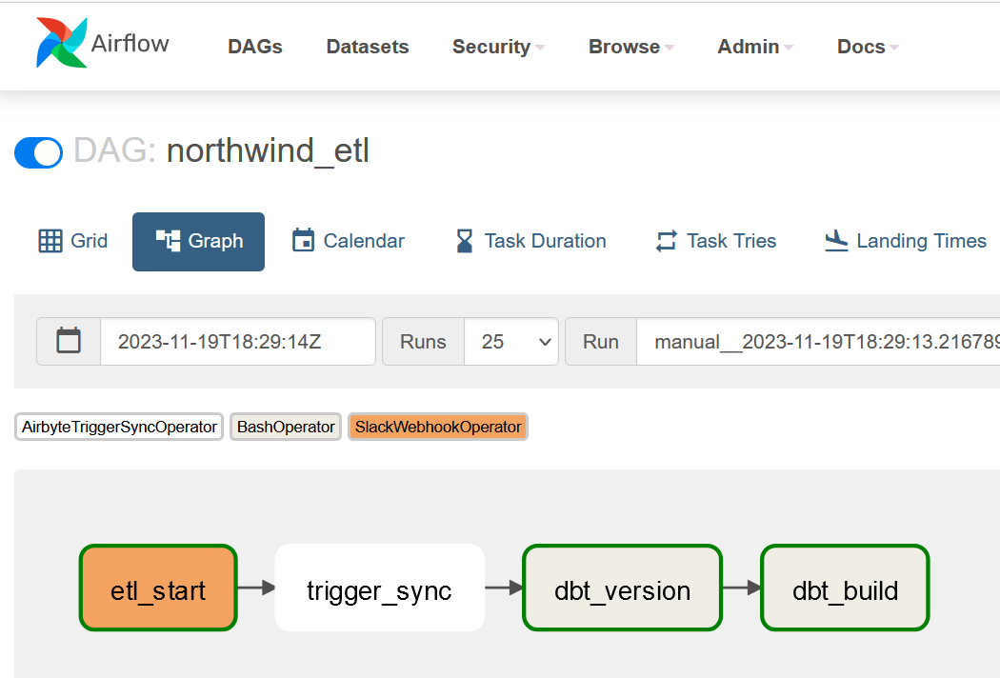
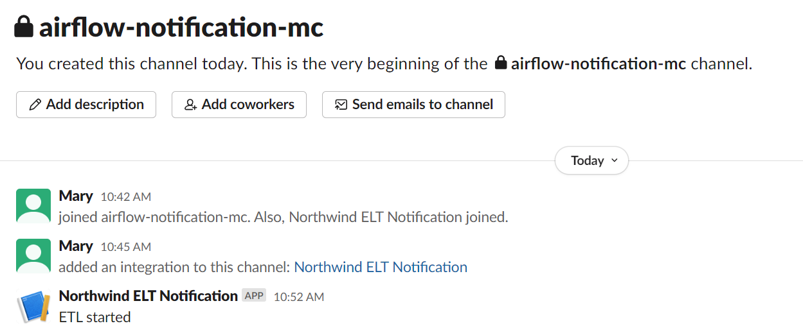

# dec_northwind
Welcome to my final course project for <a href="https://dataengineercamp.com/">Data Engineer Camp</a>.

This is an ELT project for retail data.

# TABLE OF CONTENTS
[1. Objective](#objective)

[2. Solution Architecture](#solution-architecture)

[3. Dimensional Model](#dimensional-model)

[4. Approach](#approach)

&nbsp;&nbsp;&nbsp;&nbsp;&nbsp;&nbsp;[4.1 Hosting Northwind database on RDS](#hosting-northwind-database-on-rds)

&nbsp;&nbsp;&nbsp;&nbsp;&nbsp;&nbsp;&nbsp;&nbsp;&nbsp;&nbsp;&nbsp;&nbsp;[4.1.1 Enabling CDC on RDS database](#enabling-cdc-on-rds-database)

&nbsp;&nbsp;&nbsp;&nbsp;&nbsp;&nbsp;[4.2 Data Ingestion using Airbyte](#data-ingestion-using-airbyte)

&nbsp;&nbsp;&nbsp;&nbsp;&nbsp;&nbsp;[4.3 Data Transformation using dbt](#data-transformation-using-dbt)

&nbsp;&nbsp;&nbsp;&nbsp;&nbsp;&nbsp;&nbsp;&nbsp;&nbsp;&nbsp;&nbsp;&nbsp;[4.3.1 Data tests](#data-tests)

&nbsp;&nbsp;&nbsp;&nbsp;&nbsp;&nbsp;&nbsp;&nbsp;&nbsp;&nbsp;&nbsp;&nbsp;[4.3.2 DEV and PROD runs](#dev-and-prod-runs)

&nbsp;&nbsp;&nbsp;&nbsp;&nbsp;&nbsp;[4.4 Orchestration using Airflow](#orchestration-using-airflow)

&nbsp;&nbsp;&nbsp;&nbsp;&nbsp;&nbsp;&nbsp;&nbsp;&nbsp;&nbsp;&nbsp;&nbsp;[4.4.1 Worflow Notifications](#workflow-notifications)

&nbsp;&nbsp;&nbsp;&nbsp;&nbsp;&nbsp;[4.5 Data Visualization using Preset](#data-visualization-using-preset)

[5. Next Steps](#next-steps)

## OBJECTIVE
Create an ELT pipeline moving data from the sample <a href="https://www.postgresqltutorial.com/postgresql-getting-started/postgresql-sample-database">Northwind PostgreSQL database</a> to Snowflake where curated tables can be used for reporting and insights.

## SOLUTION ARCHITECTURE

**Figure** : Project solution architecture

## DIMENSIONAL MODEL
The final curated tables in Snowflake are the following:

**Figure**: Project entity relationship diagram

In addition to these tables, a **one big table** is also created to be used for Preset visualization.

## APPROACH
### Hosting Northwind database on RDS
An RDS instance as shown was created to host the PostgreSQL database.

**Figure**: RDS database

#### Enabling CDC on RDS database
Because the Northwind datasets did not have a natural cursor field, CDC was enabled to allow for incremental syncing. This initially caused some hiccups as enabling replication on an RDS database requires slightly different commands, as found <a href="https://stackoverflow.com/questions/61912680/postgres-aws-rds-failed-to-create-replication-users">here</a> - thanks to the instructors for helping troubleshoot this!

### Data Ingestion using Airbyte
Airbyte was used to ingest data from PostgreSQL to Snowflake warehouse.

The **Source** was the RDS PostgreSQL instance containing the Northwind database.

The **Destination** was a Snowflake database named AIRBYTE_DATABASE. 

The replication is incremental as pictured in this Airbyte screenshot, using the _ab_cdc_lsn field created by enabling CDC.

**Figure**: Airbyte connection

### Data Transformation using dbt
1. Airbyte syncs raw tables to a database in the Snowflake account
2. dbt models create staging, snapshot, and serving tables. 
3. The snapshot table of stg_customer_customer_tier is used to implement dim_customer_tier as a slow-changing dimension table. The idea here was that we would like a record for each time a customer changes between Basic and Premium tier so that we always know under what tier was a specific order made. It also allows for analysis on tier migration behaviour (e.g. how long do customers take on average to upgrade to Premium, how long do they stay as Premium).

#### Data Tests
1. Each serving table has dbt tests defined in the model's yml file. The unique, not_null, and accepted_values tests were used in various models.
2. An additional singular test was created called discount_range and is stored within the tests folder. As the discount column in the order detail table should only be a value within 0 and 1 (represents the percent discount given in decimal form), the test looks for any records where the discount record is below 0 or above 1.

#### DEV and PROD runs
There are 2 Snowflake databases - a PROD and a DEV. 

**Figure**: Snowflake databases

All dbt models have the following jinja snippet in their yml files so that the tables are written to either the PROD or DEV database depending on what the target is set as in the profiles yml file.

**Figure**: Jinja script allowing for dynamic toggle between PROD and DEV databases

### Orchestration using Airflow
Airflow was used to orchestrate the Airbyte sync and dbt project run.

**Figure**: Airflow dag

This required the following setup in Airflow:
1. An Airbyte connection
2. Airflow variables to store the Snowflake dbt user login credentials

#### Workflow Notifications
An attempt to add Slack notifications for the Airflow dag runs was also made.

This required the following setup:
1. Creation of a new Slack app in the 2023-07 Data Engineer Camp workspace
2. Creation of a new private Slack channel "#airflow-notification-mc" where the notification messages would be sent
3. Enabling webhooks and creation of a new webhook in the 2023-07 Data Engineer Camp workspace
4. An Airflow connection for Slack with HTTP connection with the password for the webhook created in the previous step
5. Import and usage of the SlackWebhookOperator to create a new dag task which sends a custom message to the Slack channel created in step 2 - in this case the message was "ELT started" and this task is first in the dag
   
**Figure**: Sample successful Slack notifications of Airflow dag

### Data Visualization using Preset
A Preset dashboard was created to visualize key metrics. 

**Figure**: Preset dashboard

This required the creation of some metrics created in the semantic layer including: 
- total orders
- total active Premium customers
- Premium customer sales penetration
- average days to ship
- total units sold
- percent of orders sold on discount

## Next Steps
A few items that would require further tweaking or I had hoped to complete as part of initial scope but ran out of time:
1. Additional singular tests
2. Split out dbt tasks within Airflow dag to reflect dependencies of models
3. More complex Slack notifications such as failure notifications that specify which task failed and log details
