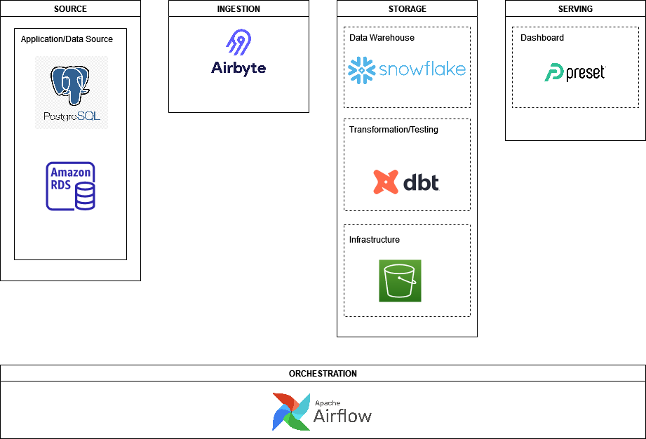

# Project Plan

## Objective
My objective is to extract datasets from the Northwind PostgreSQL database to create tables that can be used for customer and business insights.

## Consumers
The consumers of our data would be analysts looking to derive insights on sales performance and customer behaviour. 

## Sample Questions
Which customer segment is most valuable?

Which category is performing best/worst?

How fast are average shipping times?

## Datasets
I will be using the Northwind database: https://github.com/pthom/northwind_psql

## Business Process Modelling
TBD

## Solution Architecture

## Breakdown of Tasks
I will be using Trello to break down required tasks and track progress.
